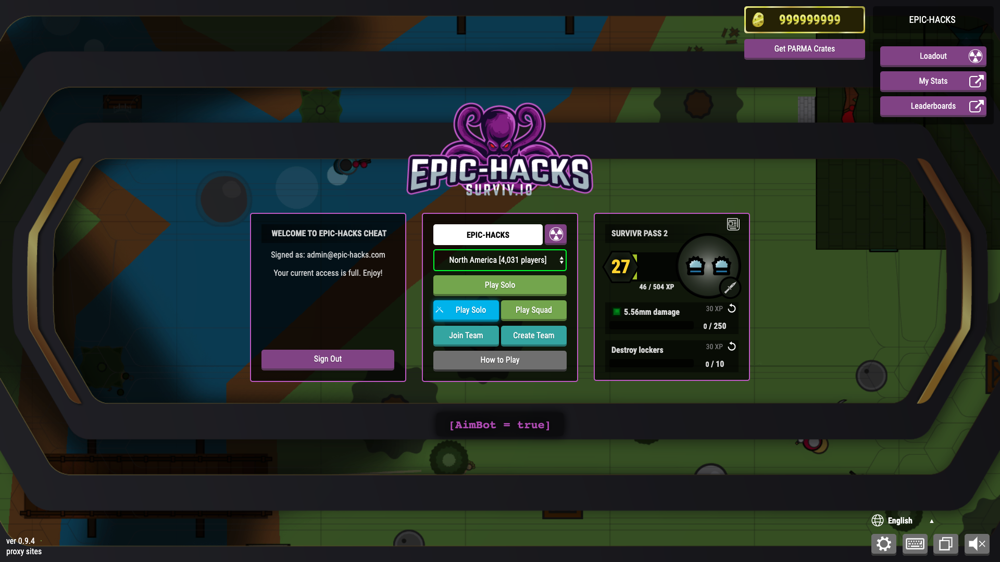

# RELEASED 1.1.0. Download an update and open new features!
# Premium Surviv Cheats (DOWNLOAD AVAILABLE)

🎁 🥺 We are giving the _Premium_ EPIC-account for everyone until May 27! 🥺 🎁

The following features are available with BASIC account:
1. 🔶 __Auto loot, auto doors__ - picks up loot && opens doors.
2. 🔥 __Bumpfire__ - no more constant mouse clicks.
3. 🕶 __ESP__ - displays other players, bullet scattering, explosives etc.
4. ⏳ __Grenade Timer__ - displays the countdown if the granate is active but still in hand.
5. 🧐 __Transparancy__ - look through the trees and roofs.

The PREMIUM account includes all the features of the basic account AND:
1. 😈 __EPIC Aim Bot__ - smart & precise aimbot at players and objects with highlighting the selected enemy.
2. ⚔️ __Ammo viewer__ - shows the current ammo in each weapon
3. ⌨️ __Bind Toggles__ - bind ANY button to toggle another cheats, such as EPIC Aim Bot, Smart Switch, SpinBot etc.
4. 🤝 __Friends__ - add in-game friends (EPIC cheaters). If you join the same game, you will exclude your friends from aimbot even if you are not in team.
5. 🍳 __Pan/Sword Hero__ - passive reflection of any bullets if you have a pan or laser sword.
6. 🎚 __Smart Switch__ - the BEST weapon switcher you've ever seen. Switches the weapons depending on the range to the enemy, QQ's single weapons to remove the slowdown after shot, swithes if run out of ammo.
7. 👾 __Spin Bot__ - spins as fast as You can't.

If you found any bugs or want to suggest a feature, [head up with any discussion here](https://github.com/epic-hacks/epic-hacks-surviv.io/issues). 



## Download
1. Visit [download page](https://github.com/epic-hacks/epic-hacks-surviv.io/releases/latest).
2. Under "Assets" click "latest.zip" and ZIP file with the latest cheats will be downloaded.

## Install
1. Unzip the downloaded file.
2. Go to Chrome Extensions (choose one of the following):
   - Chrome -> Settings -> More Tools -> Extensions.
   - OR type ```chrome://extensions``` in the address bar.
3. Enable the developer mode on the top right corner.
4. Click __"Load Unpacked"__ on the top left corner and select the folder that you extracted in step 1.

## Not working?
Feel free to drop an Issue above. We constantly updating our cheats to head up with every surviv update.

## Suggestions
If you have any suggestions on how to improve our cheat (update existing modules or add new one etc.) - create an issue above with the __"enchancement"__ label.
